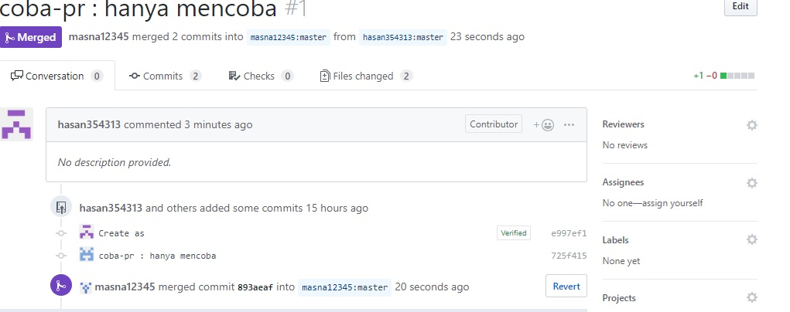

## Berkolaborasi di git repository

Selain untuk mengelola aset digital milik diri sendiri, kita bisa menggunakan Git untuk berkolaborasi dalam suatu repo di GitHub yang bisa diakses bersama. Dalam kasus seperti ini, berarti ada 2 peran:

1. Pemilik repo, sering disebut sebagai *upstream author*.
2. Kontributor, yaitu orang-orang yang akan berkontribusi memberikan konten.

Untuk situasi seperti ini, diasumsikan:

1. *Upstream author* telah membuat repo git di GitHub
2. Kontributor telah mengetahui adanya repo tersebut, tertarik untuk berkontribusi, sudah mengetahui apa yang akan diberikan ke proyek (repo GitHub *upstream author*) tersebut.
3. Pembahasan selanjutnya adalah tentang bagaimana kontributor bisa mengirimkan kontribusi ke repo GitHub milik *upstream author*.

Skenario:

1. *Upstream author* adalah *masna12345*.
2. Kontributor adalah *hasan354313*
3. Repo dari *upstream author* adalah **playground** yang bisa diakses di [https://github.com/masna12345/coba-pr](https://github.com/masna12345/coba-pr.git)

## Forking

Fork adalah membuat clone dari suatu repo di GitHub milik *upstream author*, diletakkan ke milik kontributor. Fork hanya dilakukan sekali saja. Kontributor harus mem-*fork* repo *upstream author* sehingga di repo kontributor muncul repo tersebut. Proses *forking* ini dijelaskan dengan langkah-langkah berikut:

1. Login ke Github
2. Akses repository *Upstream Author* di [https://github.com/masna12345/coba-pr](https://github.com/masna12345/coba-pr)

3. Pada sisi kanan atas, pilih fork.

    

4. Repository akan ditaruh di akun  *masna12345*

    

5. Setelah selesai proses forking, clone repository ke local untuk mulai berkontribusi. Dengan cara, pilih tombol *Clone or Download* yang ada di sisi kanan atas, pilih *https* kemudian copy url dari repository. `coba-pr` adalah nama repository dari hasil fork karena sudah ada nama repository `coba-pr` untuk akun `hasan354313`

    

    Clone repostory ke local dengan menjalanlan perintah:

    ```git clone repository_url```

6. Buat perubahan. Dalam kasus ini buat folder baru.

    

    Keterangan: `cd coba-pr` hasil cloning repository, kemudian buat folder baru dengan nama `pull-request-masna` dengan perintah `mkdir pull-request-masna` buat file kosong dengan `.empty` dengan perintah `touch .empty` hal ini karena git akan mengabaikan direktori kosong ketika proses push ke remote repository.

7. Lihat perubahan dengan perintah `git status`

    

    Keterangan: `git status` adalah perintah `git` untuk melihat perubahan apa saja yang ada di local, dalam hal ini terlihat ada 1 buath file `.empty` di dalam direktori `pull-request-masna` yang belum ada di dalam `remote repository`.

8. Tambahkan file/folder baru ke remote repository dengan perintah `git add .`

    


    Keterangan: `git add .` perintah ini digunakan untuk menambahkan `untracked files` yang ada di `local` ke `remote`. Jalankan perintah `git status` untuk memastikan file sudah daftarkan untuk di tambah ke remote repository ketika di lakukan push, ditandai dengan status `new file: .empty` dengan warna hijau.

9. `git commit`: Setelah perubahan yang diinginkan sudah selesai di lakukan, file/folder sudah ditata dan sudah ditambahkan, langkah selanjutnya rekam perubahan (commit).

    

    Keterangan: `git commit -m 'tcclanjut: Make some pr'` perintah ini digunakan untuk merekam perubahan yang ada di local dan memberikan pesan perubahan apa yang dilakukan atau memeberi pesan kepada author/kontributor lain tentang pekerjaan yang sudah dilakukan.

10. Push/kirim perubahan yang ada di local ke repository git, setelah perubahan yang ada dilocal di commit.

    

    Keterangan: `git push origin master` > Push (kirim) perubahan ke remote:origin yaitu repository milik sendiri, `master` adalah nama branch yang digunakan untuk menyimpan file/asset yang sudah di ubah.


11. Pull request ke `upstream` repo, dengan cara klik pada tombol `New pull request`

    

    Muncul halaman baru untuk melakukan pull request, halaman ini digunakan untuk melihat dan membandingkan perubahan apa saja yang di lakukan di head repository dengan base repository. Halaman ini juga digunakan untuk memastikan bahwa perubahan sudah sesuai dengan keinginan dan tidak ada `conflict` ketika akan di lakukan *PR*.

    Jika sudah yakin dengan perubahan yang dilakukan, klik tombol hijau : `Create pull request` untuk melakukan Pull Request.

12. *Open Pull Request*

    

    Jika file yang diubah tidak ada conflict akan ada notifikasi `Able to merge` ini menandakan tidak ada masalah dengan perubahan yang kita lakukan dengan base repository, dan pull request bisa di merge. Form ini digunakan untuk mencatat pesan PR ke pemilik base repository. Klik tombol `Create pull request` untuk melakukan `pull request`.


13. Pada repo `upstream author`, muncul angka 1 (artinya jumlahnya 1) pada Pull requests di bagian atas.

14. *Upstream author* bisa menyetujui setelah melakukan review: klik pada ```Pull requests```, akan muncul PR dengan message seperti yang ditulis oleh kontributor (*Add: contributor*). Klik pada PR tersebut, review kemudian klik ```Merge pull request``` diikuti dengan ```Confirm merge```. Setelah itu, status akan berubah menjadi ```Merged```.

    