# Docker #

Tutorial dengan menggunakan Katakoda
1. Menjalankan Docker Kontainer
   
Docker container berjalan berdasarkan Docker Image. Docker Image ini berisi tentang semua kebutuhan untuk menjalankan sebuah proses. Ada beberapa docker image yang sudah tersedia di Docker Registry atau jalankan perintah docker search nama-docker-image. Contoh kasus docker image redis. Perintah docker search <name> ini berfungsi untuk mencari apakah docker image yang diinginkan sudah tersedia di Docker Registry atau belum.
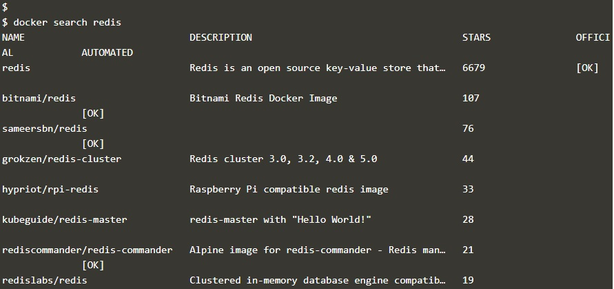
Dari perintah docker search redis akan menghasilkan daftar docker image yang sudah terdaftar di dalam Docker Registry dan bisa digunakan untuk kebutuhan development. Dari daftar yang muncul Docker Image Redis terdaftar dengan nama redis. Untuk menjalankan Docker Image Redis di local Docker CLI terdapat perintah yang akan menjalankan Docker Container berdasarkan nama dari Docker Image, perintah nya adalah docker run <options> <image-name> Doc.

Secara default docker akan menjalankan kontainer di foreground. Untuk menjalankan container secara background gunakan opsi -d. Perintahnya seperti berikut : docker run -d redis

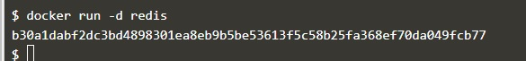

Perintah di atas akan menghasilkan output berupa container ID seperti yang ada di dalam gambar diatas. Secara default docker akan menjalankan container (docker image) versi terakhir. Jika ingin menjalankan docker image versi tertentu sertakan versi dari docker image yang ada, dengan perintah docker run -d redis:3.2. Berdasarkan perintah ini, Docker CLI akan me-download docker image redis versi 3.2 jika image yang dimaksud belum ada di local.

2. Mencari kontainer yang berjalan
   
Kontainer yang sudah dijalankan menggunakan opsi -d akan berjalan di background, untuk memastikan kontainer yang berjalan sesuai dengan yang diinginkan gunakan perintah docker ps, perintah ini digunakan untuk menampilkan daftar semua kontainer yang berjalan di local komputer. Dari perintah ini kita bisa mendapatkan Container ID dan Nama Container yang sedang berjalan, seperti pada gambar dibawah ini.

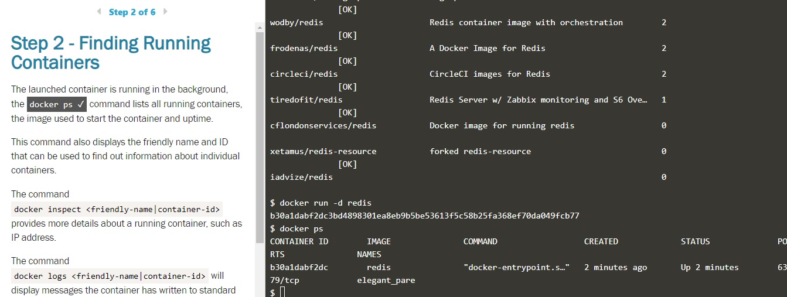


3 : Accessing Redis
Sebuah docker container yang berjalan tidak akan bisa di akses oleh host computer jika port dari container tidak di expose. Perintah untuk me-expose port dari docker container supaya bisa di akses dari host computer adalah docker run -d --name redisHostPort -p 6379:6379 redis:lates.

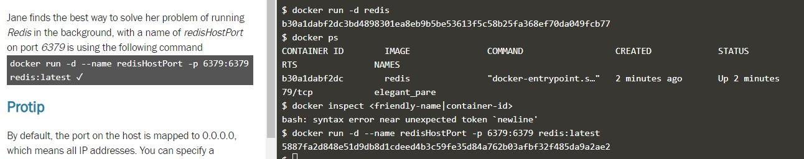

Perintah di atas akan menjalankan kontainer redis versi terupdate dengan nama redisHostPort, dan expose port redis (port default) container melalui host port 6379. Sehingga ketika host akses port 6379 sama saja melakukan akses terhadap container redis yang dijalankan. Opsi -name redisHostPort disini digunakan untuk identifikasi nama container yang berjalan, untuk mempermudah mengenali kontainer.

Step 4 : Accessing Redis
Permasalahan ketika menjalankan docker pada port yang fixed adalah kita tidak bisa menjalankan beberapa instance secara bersamaan. Untuk menjalankan beberapa instance secara bersamaan jalankan perintah docker run -d --name redisDynamic -p 6379 redis:latest abaikan host port, dengan cara ini docker akan me-assign host port secara otomatis, akan mencarai port yang tersedia untuk mem-binding port 6379 milik container redis dengan port yang tersedia milik host.

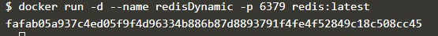

Untuk mengetahui container berjalan di port mana gunakan perintah docker port redisDynamic 6379

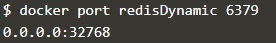

Selain menggunakan perintah di atas, docker ps juga bisa digunakan untuk melihat port mapping dari contaniner yang sedang berjalan.


Step 5 : Persisting Data
Data yang ada di dalam container docker akan ikut hilang jika container yang ada dihapus atau container di buat baru. Untuk menghindari kehilangan data, docker CLI ada opsi untuk binding volumes yaitu mount volume local ke dalam volume container dengan menyertakan opsi -v <host-dir>:<container-dir>. Dengan opsi ini semua yang ada di mounted-volume akan sama dengan yang ada di dalam container, jika container di hapus atau di buat ulang, data akan tetap tersimpan di volume local.

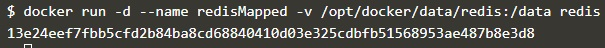

6 : Running A Container In The Foreground
Pada langkah-langkah sebelumnya, perintah docker yang dijalankan menyertakan opsi -d yang mana container berjalan di background, jika ingin menjalankan container secara foreground hilangkan opsi -d, dengan begitu kita bisa berinteraksi dengan container. Contoh menggunakan perintah ps milik OS Ubuntu, untuk menampilkan proses yang berjalan di dalam container ubuntu.

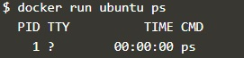

Untuk bisa berintaksi dengan bash shell milik ubuntu sertakan opsi -it, dengan opsi ini container akan berjalan dan kita bisa meng-akses bash shell docker run -it ubuntu bash

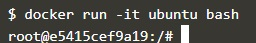


### Docker - Deploy Static HTML Website 

Docker image dapat berjalan berdasarkan base image. Docker image harus menyertakan semua kebutuhan yang dibutuhkan oleh aplikasi yang ingin dijalankan menggunakan environment docker. Base image image yang berisi tentang instruksi, perintah-perintah di sebut dan diberi nama dengan Dockerfile, docker CLI akan mengidentifikasi file Dockerfile. Contoh kasus membuat web statis menggunakan http server nginx

1 : Create Dockerfile
Buat sebuah file dengan nama Dockerfile dan isi dengan content seperti berikut:

```markdown
FROM nginx:alpine
COPY . /usr/share/nginx/html
```
Pada baris pertama mendefinisikan bahwa kita akan menggunakan base image nginx:alpine, dan pada baris kedua perintah untuk meng-copy semua isi directory ke directory container `/usr/share/nginx/html` yaitu directory default nginx untuk menampung semua file html.

2 : Build Docker Image
Untuk menjalankan app (web static menggunakan nginx) yang perlu dilakukan adalah mem-build Dockerfile menjadi docker-image yang bisa dijalankan oleh Docker CLI dengan perintah docker build -t <repository-name> .

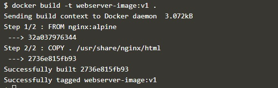

opsi -t webserver-image:v1 digunakan untuk memberikan nama pada docker image dengan webserver-image dan tag docker image dengan v1. Untuk memastikan image yang ada di dalam host komputer jalankan perintah docker images

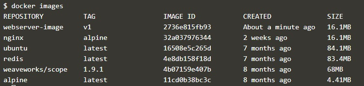

3 : Run
Docker image yang sudah selesai di build, dapat dijalankan dengan perintah docker run -d -p 80:80 webserver-image:v1.
Setelah docker image sukses dijalankan, webserver akan bisa diakses melalui browser dengan mengakses hostname port 80. Untuk mengetest apakah docker container berjalan gunakan perintah curl docker

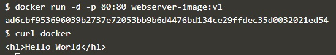

Jika diakses melalui browser akan menghasilkan output seperti gambar dibawah.

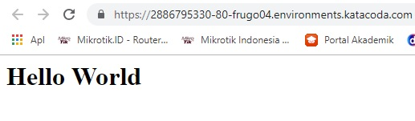
