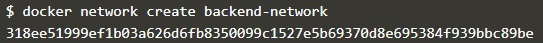
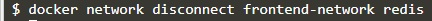

# Pertemuan Minggu-04

## Docker - Menghubungkan antar jaringan

>[https://katacoda.com/courses/docker/5](https://katacoda.com/courses/docker/5)

### Step 1 - Start Redis

Umumnya dalam implementasi `links` adalah menghubungkan container (aplikasi) dengan data-store container, praktikum kali ini yaitu menggunakan docker image _redis data store_. Secara default ketika menjalankan sebuah container, docker akan membuat nama untuk container yang dijalankan. Untuk kemudahan dalam penggunaan `links` definisikan `name` container yang dijalankan.

```markdown
docker run -d --name redis-server redis
```

### Step 2 - Create Link

Untuk menghubungkan dengan container asal gunakan opsi `--link <container-name|id>:<alias>` ketika menjalankan container yang baru.

> Bagaimana Link bekerja?

Pertama, docker akan mengeset beberapa environment variable berdasarkan container sumber. Untuk menampilkan environment variable gunakan perintah: `docker run --link redis-server:redis alpine env`


Selanjutnya, Docker akan melakukan update terhadap file `HOSTS` pada container dengan 3 variable yaitu: _the original, the alias and the hash-id_

jalankan perintah `docker run --link redis-server:redis alpine cat /etc/hosts`


Ketika link sudah terbuat lakukan ping terhadap container dengan perintah `docker run --link redis-server:redis alpine ping -c 1 redis`


### Step 3 - Connect to app

Dengan Link yang dibuat, aplikasi dapat terhubung dan berkomunikasi dengan sumber container dengan cara biasa, terlepas dari kenyataan bahwa kedua layanan berjalan dalam container.

Berikut adalah aplikasi node.js sederhana yang terhubung ke redis menggunakan redis hostname.

```docker run -d -p 3000:3000 --link redis-server:redis katacoda/redis-node-docker-example```


> Test Koneksi

Mengirim permintaan HTTP ke aplikasi akan menyimpan permintaan di Redis dan mengembalikan hitungan. Jika Anda mengeluarkan beberapa permintaan, Anda akan melihat kenaikan penghitung saat item tetap ada.

```curl docker:3000```


### Step 4 - Connect to Redis CLI

Dengan cara yang sama,kita dapat menghubungkan Container ke aplikasi, kita juga dapat menghubungkannya dengan tools CLI mereka sendiri.

>Meluncurkan Redis CLI
Perintah di bawah ini akan meluncurkan sebuah instance dari  Redis-cli-tool dan terhubung ke server redis melalui alias-nya
```docker run -it --link redis-server:redis redis redis-cli -h redis redis:6379```


## Docker - Networks

>[https://katacoda.com/courses/docker/networking-intro](https://katacoda.com/courses/docker/networking-intro)

Praktikum pertemuan 4 ini dengan menggunakan katacoda course akan mencoba membuat docker network yang memungkinkan setiap docker container bisa saling berkomunikasi.

### Step 1 -  Membuat Jaringan

Jalankan perintah `docker network create backend-network` perintah ini digunakan untuk membuat docker network dengan nama `backend-network`. [Info detail](https://docs.docker.com/network/)



Setelah docker network terbuat, sertakan opsi `--net` ketika menjalankan docker container. Contoh menggunakan docker image redis


Perintah diatas akan menjalankan container redis dan menjalankan menggunakan docker network `backend-network`.

### Step 2 - Network Communication

Tidak seperti links, `docker network` berperilaku seperti jaringan tradisional, dimana setiap node bisa di pasang/lepas.

Lihat environment variable dari sebuah container dengan menjalankan perintah `docker run --net=backend-network alpine env`, perintah ini akan menampilkan semua environment variable dari sebuah container.


Semua dns pada docker network akan di assign melalui IP `127.0.0.11` yang sudah di set pada `/etc/resolv.conf`


Dan ketika 1 container melakukan ping menggunakan hostname dari container tujuan, ping akan mengembalikan output berupa IP Address dari hostname container tujuan. Contoh ping redis container yang sudah jalan dari container alpine.


### Step 3 - Menghubungkan 2 Container

Docker support multiple nerwork dan container bisa di attach ke 1 jaringan secara bersamaan.

Buat docker network baru dengan nama `frontend-network`


Untuk menghubungkan container yang berjalan dengan suatu docker network gunakan perintah `docker connect`


Perintah ini akan me-attach redis ke dalam `frontend-network` yang baru saja dibuat. Jalankan web server dan assign network ke dalam `frontend-network`, sama dengan `redis` sehingga webserver bisa berkomunikasi dengan redis melalui jaringan yang sama.


Ketika ditest menggunakan curl, bisa di akses pada 1 hostname yaitu `docker`


### Step 4 - Buat Alias

Alias pada docker akan mempermudah ketika akan mengakses kontainer. Dengan alias ini kita bisa mendefinisikan nama (dns) dari container yang akan kita akses. Dalam course ini, redis menggunakan alias db yang lebih bisa merepresentasikan bahwa redis yang dijalankan disini akan digunakan sebagai database dari webserver.

Buat network baru dengan nama `frontend-network2` dengan perintah `docker network create frontend-network2`

Kemudian jalankan redis pada network yang baru dibuat dan beri alias db:


Dengan begitu redis bisa di akses dengan nama db.


### Step 5 - Disconnect Containers


`docker network ls` adalah perintah docker untuk menampilkan `docker network` yang sudah ada di komputer. Dari informasi jaringan ini kita bisa menampilkan informasi detail dari docker network termasuk docker container mana yang menggunakan docker network tertentu.


Untuk melepaskan container dari docker network tertentu, gunakan perintah `docker network disconnect frontend-network nama-container`.

